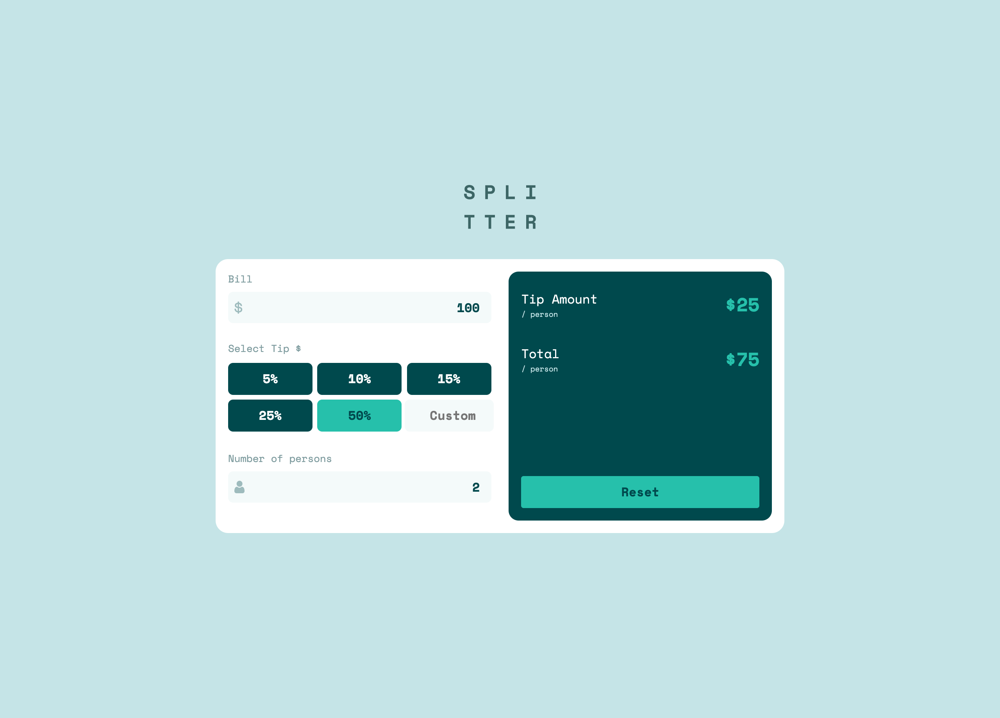

# Tip calculator - Vue.js 2

This project was a study about different ways to create the same project. This was made using **Vue.js 2 with TypeScript**, but you can switch between branches and view the **VanillaJS** and **TypeScrip** version. All versions was made using **Jest** and **Cypress**.

### About

 

The ideia behind this version is to create a version of a **Tip Calculator** using **Vue.js 2**, **TypeScript**, **Cypress** and **Jest**.

### The challenge

Users should be able to:

- View the optimal layout for the app depending on their device's screen size
- See hover states for all interactive elements on the page
- Calculate the correct tip and total cost of the bill per person

**The project ideia is from [Frontend Mentor challenges](https://www.frontendmentor.io/challenges/tip-calculator-app-ugJNGbJUX).**

### Built with

- [Vue.js 2](https://vuejs.org/)
	- [Vue Class Components](https://class-component.vuejs.org/)
	- [Vue Property Decorator](https://github.com/kaorun343/vue-property-decorator)
- [TypeScript](https://www.typescriptlang.org/)
- [Vuex](https://vuex.vuejs.org/)
	- [Vuex Module Decorator](https://github.com/championswimmer/vuex-module-decorators)
- [SCSS](https://sass-lang.com/)
- [Jest](https://jestjs.io/pt-BR/)
	- [Testing Library - Vue](https://testing-library.com/docs/vue-testing-library/intro/)
	- [Testing Library - Jest DOM](https://testing-library.com/docs/ecosystem-jest-dom/)
	- [Testing Library - User Event](https://testing-library.com/docs/ecosystem-user-event)
	- [Vue Test Utils](https://vue-test-utils.vuejs.org/)
- [Cypress](https://www.cypress.io/)

There is libraries like Babel, ESLint, and other stuffs like that in the project too.

#### About the unit test strategy
In this project I made two unit test strategies at the same time and you will find `.spec` and `.test` file.
In all `.spec` files I used the `vue-test-utils` library or just jest default.
In all `.test` files you can find the **Testing Library** strategy.

**This was intentional and my goal was to see the difference between this two libraries in test creation.**

## Author

- Website - [IanWelerson.com](https://ianwelerson.com)
- Twitter - [@IanWelerson](https://www.twitter.com/ianwelerson)